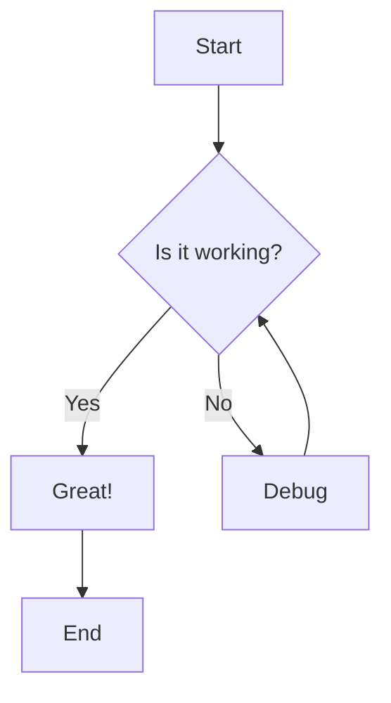

# Mermaid 流程图文档工具 - 快速启动指南

## 🎯 功能简介

一个**纯前端**的 Mermaid 流程图文档工具，支持：
- 📝 编辑 Mermaid 流程图
- 🎨 实时渲染预览
- 📄 为每个节点添加富文本文档
- 💾 自动保存到浏览器本地

## ⚡ 快速启动

### 1️⃣ 安装依赖

```bash
cd frontend
npm install --legacy-peer-deps
```

> 💡 已在 `package.json` 中添加 `mermaid: ^11.4.1`

### 2️⃣ 启动开发服务器

```bash
npm run dev
```

### 3️⃣ 访问页面

```
http://localhost:3001/docs/mermaid
```

## 📖 使用说明

### 基本操作

1. **编辑流程图**：在左侧面板输入 Mermaid 代码
2. **查看渲染**：中间面板自动渲染流程图
3. **选择节点**：点击图表中的节点
4. **编辑文档**：在右侧面板为节点添加说明

### 示例代码



## 📂 新增文件一览

```
frontend/src/
├── app/docs/mermaid/
│   ├── page.tsx                   # 页面入口
│   ├── page.module.css           # 页面样式
│   └── components/
│       ├── MermaidEditor.tsx     # 源码编辑器
│       ├── MermaidRenderer.tsx   # 渲染区域
│       ├── NodeDocEditor.tsx     # 文档编辑器
│       └── index.module.css      # 组件样式
├── stores/
│   └── mermaidStore.ts           # Zustand store
└── utils/
    └── mermaidUtils.ts           # Mermaid 工具函数
```

## 🔧 技术栈

- **框架**：Next.js 15 (App Router)
- **状态管理**：Zustand 5.0
- **图表渲染**：Mermaid 11.4
- **样式**：CSS Modules
- **持久化**：localStorage

## 💡 核心特性

### 1. 三栏布局
- **左侧**：Mermaid 源码编辑器
- **中间**：流程图渲染预览
- **右侧**：节点文档编辑器

### 2. 自动保存
- 编辑后 2 秒自动保存
- 页面刷新前自动保存
- 数据保存在浏览器 localStorage

### 3. 实时预览
- 代码变化 300ms 后自动渲染
- 支持语法错误提示

### 4. 富文本编辑
- 支持粗体、斜体、下划线
- 支持列表、标题
- 使用 contenteditable 实现

## 🎨 界面预览

```
┌────────────────────────────────────────────────────────────┐
│  📊 Mermaid Diagram Documentation Tool                     │
├────────────────┬─────────────────────┬─────────────────────┤
│  Mermaid       │   Diagram Preview   │  Node Documentation │
│  Source        │                     │                     │
│                │                     │                     │
│  graph TD      │      ┌───┐          │  Selected: A        │
│    A[Start]    │      │ A │          │                     │
│    A --> B     │      └─┬─┘          │  [B] [I] [U] ...   │
│    B --> C     │        │            │                     │
│                │      ┌─▼─┐          │  Start Node         │
│  [Save]        │      │ B │          │  This is the...     │
│                │      └───┘          │                     │
│                │                     │  [Save All]         │
└────────────────┴─────────────────────┴─────────────────────┘
```

## 📝 详细文档

查看完整文档：
- **使用指南**：`frontend/MERMAID_DOCS_TOOL.md`
- **实现总结**：`frontend/MERMAID_IMPLEMENTATION_SUMMARY.md`

## 🔍 常见问题

### Q: 数据保存在哪里？
A: 所有数据保存在浏览器的 localStorage，不会上传到服务器。

### Q: 支持哪些 Mermaid 图表类型？
A: 目前测试了 flowchart (graph)，理论上支持所有 Mermaid 图表类型。

### Q: 如何导出数据？
A: 当前版本暂不支持导出，数据保存在浏览器本地。可以在浏览器开发工具中查看 localStorage。

### Q: 支持多人协作吗？
A: 当前版本不支持，这是一个纯前端单用户工具。

## 🚀 下一步

1. ✅ 启动项目，体验基本功能
2. 📖 阅读详细文档了解技术实现
3. 🎨 根据需求自定义样式
4. 🔧 扩展功能（导出、搜索等）

## 📞 获取帮助

- Mermaid 语法：https://mermaid.js.org/
- Zustand 文档：https://zustand-demo.pmnd.rs/
- Next.js 文档：https://nextjs.org/docs

---

**祝使用愉快！** 🎉

