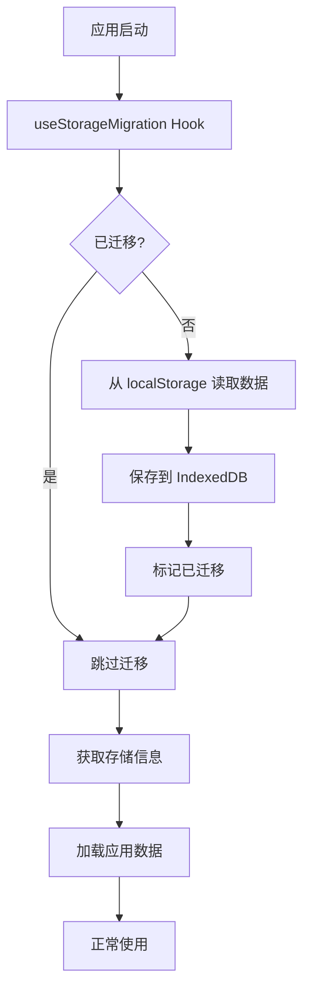

# IndexedDB Storage Migration Guide

## 问题 (Problem)

之前的实现使用 localStorage 来保存 Mermaid 文档工具的数据，包括节点文档中的 base64 图片。这导致了以下问题：

1. **容量限制**: localStorage 通常只有 5-10MB 的限制
2. **Base64 膨胀**: Base64 编码的图片比原始大小大约 33%
3. **保存失败**: 当超出容量限制时，`localStorage.setItem()` 会抛出 `QuotaExceededError`
4. **界面卡住**: 错误处理不当导致界面一直显示 "Saving..." 状态

## 解决方案 (Solution)

迁移到 **IndexedDB** 存储系统，具有以下优势：

- ✅ **大容量**: 通常几百MB到GB的存储空间
- ✅ **异步操作**: 不阻塞主线程
- ✅ **更好的性能**: 专门为大量结构化数据设计
- ✅ **向后兼容**: 自动从 localStorage 迁移数据

## 实现的变更 (Changes Made)

### 1. 新增 IndexedDB 工具类

**文件**: `frontend/src/utils/indexedDBStorage.ts`

提供了完整的 IndexedDB 操作接口：

```typescript
// 保存数据
await saveToIndexedDB(data);

// 加载数据
const data = await loadFromIndexedDB();

// 保存历史记录
await saveHistoryToIndexedDB(history);

// 加载历史记录
const history = await loadHistoryFromIndexedDB();

// 从 localStorage 迁移
await migrateFromLocalStorage();

// 获取存储信息
const info = await getStorageInfo();

// 清空数据（调试用）
await clearIndexedDB();
```

### 2. 更新 Mermaid Store

**文件**: `frontend/src/stores/mermaidStore.ts`

- 所有存储操作改为异步
- 自动从 IndexedDB 读取和保存
- 保留 localStorage 作为降级方案（向后兼容）
- 错误处理更加完善

### 3. 自动迁移 Hook

**文件**: `frontend/src/hooks/useStorageMigration.ts`

在应用启动时自动执行：
- 检测是否已迁移
- 自动从 localStorage 迁移数据到 IndexedDB
- 提供迁移状态监控
- 获取存储使用信息

### 4. 存储信息显示组件

**文件**: `frontend/src/components/storage-info/StorageInfo.tsx`

显示存储使用情况：
- 已使用空间
- 可用空间
- 使用百分比
- 警告提示（当存储空间不足时）

### 5. 页面集成

**文件**: `frontend/src/app/docs/mermaid/page.tsx`

- 集成自动迁移功能
- 在项目选择页面显示存储信息
- 等待迁移完成后再加载数据

## 数据迁移流程 (Migration Flow)



## 存储结构 (Storage Structure)

### IndexedDB Database

- **数据库名**: `mermaid-docs-db`
- **版本**: 1

### Object Stores

1. **mermaid-data**
   - 键: `'current-project'`
   - 值: 当前项目数据（mermaidCode, nodeDocs, etc.）

2. **project-history**
   - 键: `'project-history'`
   - 值: 项目历史记录数组

## 使用方式 (Usage)

### 对用户透明

迁移过程对用户完全透明，无需任何手动操作：

1. 用户打开应用
2. 自动检测并迁移数据（首次）
3. 后续使用 IndexedDB 存储
4. localStorage 数据保留作为备份

### 手动触发迁移（开发用）

```typescript
import { migrateFromLocalStorage } from '@/utils/indexedDBStorage';

// 手动触发迁移
await migrateFromLocalStorage();
```

### 清空 IndexedDB（调试用）

```typescript
import { clearIndexedDB } from '@/utils/indexedDBStorage';

// 清空所有数据
await clearIndexedDB();
```

## 存储容量监控 (Storage Monitoring)

应用会自动监控存储使用情况，并在需要时显示警告：

- **安全 (< 70%)**: 绿色进度条
- **警告 (70-90%)**: 黄色进度条 + 警告消息
- **危险 (> 90%)**: 红色进度条 + 紧急提示

用户可以：
1. 导出重要项目
2. 删除旧项目
3. 清理不需要的数据

## 兼容性 (Compatibility)

### 浏览器支持

IndexedDB 被所有现代浏览器支持：
- ✅ Chrome 24+
- ✅ Firefox 16+
- ✅ Safari 10+
- ✅ Edge 12+

### 降级策略

如果 IndexedDB 不可用或失败：
1. 自动回退到 localStorage
2. 记录警告日志
3. 应用继续工作（但容量受限）

## 性能对比 (Performance Comparison)

| 特性 | localStorage | IndexedDB |
|------|-------------|-----------|
| 存储容量 | 5-10MB | 数百MB-GB |
| 操作方式 | 同步 | 异步 |
| 数据类型 | 字符串 | 任意类型 |
| 大文件性能 | 差 | 好 |
| 阻塞UI | 是 | 否 |

## 故障排除 (Troubleshooting)

### 问题: 迁移失败

```javascript
// 检查控制台错误日志
// 手动清除并重试
localStorage.removeItem('indexeddb-migration-completed');
location.reload();
```

### 问题: 数据丢失

```javascript
// localStorage 数据仍作为备份保留
// 检查 localStorage
console.log(localStorage.getItem('mermaid-docs-tool'));
console.log(localStorage.getItem('mermaid-docs-history'));
```

### 问题: 存储空间不足

解决方案：
1. 导出重要项目到文件
2. 在项目历史中删除旧项目
3. 浏览器设置中增加存储配额（如果可能）

## 最佳实践 (Best Practices)

1. **定期导出**: 定期导出重要项目到本地文件
2. **清理历史**: 定期删除不需要的项目历史
3. **监控容量**: 关注存储使用情况警告
4. **及时保存**: 应用会自动保存，但在重要编辑后可以手动触发保存

## 技术细节 (Technical Details)

### 为什么选择 IndexedDB?

1. **标准化**: W3C 标准，所有现代浏览器支持
2. **大容量**: 适合存储包含图片的文档
3. **事务性**: 保证数据一致性
4. **异步**: 不阻塞UI，提供更好的用户体验

### 数据格式

```typescript
interface StoredData {
  id: string;                    // 'current-project'
  currentProjectId: string | null;
  mermaidCode: string;
  nodeDocs: Record<string, NodeDoc>;
  lastSavedAt: number;
}

interface NodeDoc {
  id: string;
  content: string;  // HTML with embedded base64 images
}
```

## 未来改进 (Future Improvements)

- [ ] 压缩图片以进一步减少存储空间
- [ ] 实现云端同步（可选）
- [ ] 提供存储使用详细分析
- [ ] 自动清理超过时间限制的旧项目
- [ ] 将图片提取为独立的 Blob 存储

## 总结 (Summary)

通过迁移到 IndexedDB，我们解决了以下问题：

1. ✅ 存储容量限制
2. ✅ 图片保存失败
3. ✅ 界面卡住在 "Saving..." 状态
4. ✅ 性能问题

同时保持了：
- ✅ 向后兼容（自动迁移）
- ✅ 数据安全（localStorage 备份）
- ✅ 用户体验（透明迁移）

